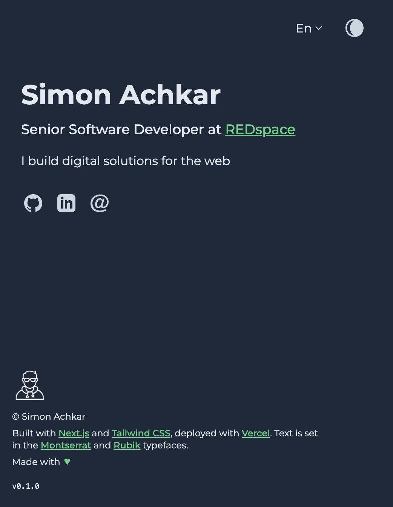
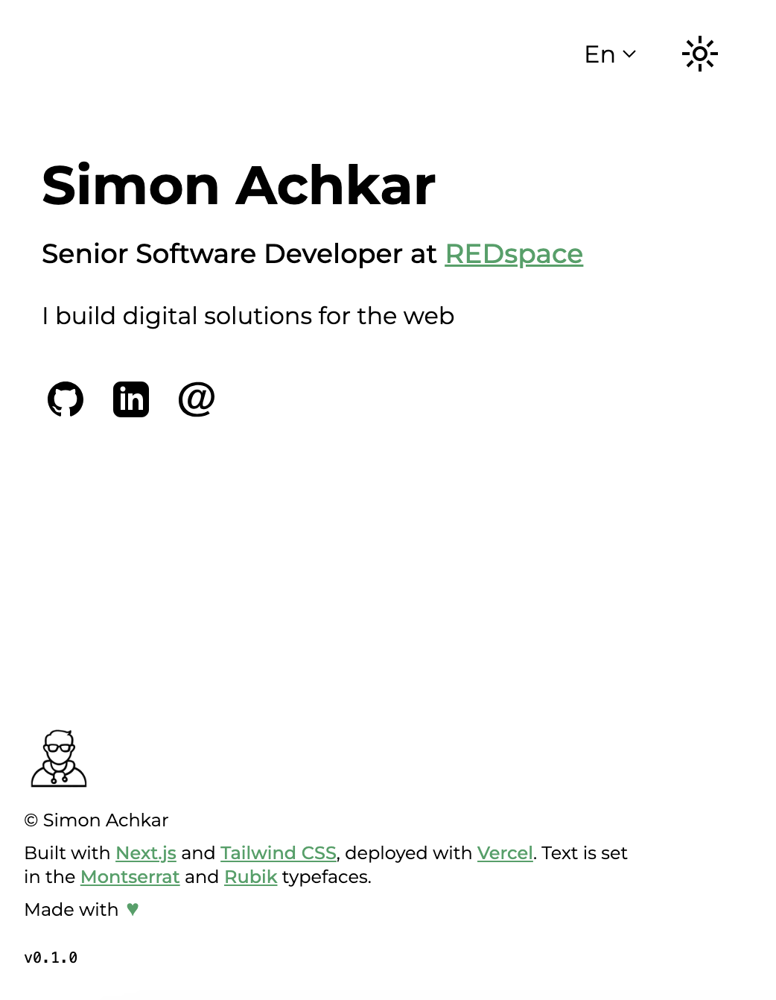

<div align="center">
  
</div>
<h1 align="center">
  simonachkar.dev
</h1>
<p align="center">
  My personal website (4th iteration). Built with <a href='https://nextjs.org' target='_blank'>Next.js</a> & <a href='https://tailwindcss.com' target='_blank'>Tailwind CSS</a> and deployed with <a href='https://vercel.com' target='_blank' rel='noreferrer'>Vercel</a>.
</p>
<p align="center">
  <a href="https://app.netlify.com/sites/brittanychiang/deploys" target="_blank">
    
  </a>
</p>

<div style="display: flex; gap: 10px; justify-content: center; width: 150px; margin: auto;">
    
    
</div>

## Getting Started

To get up and running, install dependencies and run the development server:

```
# Install dependencies.
npm install

# Run development server
npm run dev
```

## About this project

### Next.js

This is a [Next.js](https://nextjs.org/) project bootstrapped with [`create-next-app`](https://github.com/vercel/next.js/tree/canary/packages/create-next-app).

### Typefaces

This project uses [`next/font`](https://nextjs.org/docs/basic-features/font-optimization) to automatically optimize and load [Montserrat](https://fonts.google.com/specimen/Montserrat) for Latin (e.g. English/French) alphabet and [Rubik](https://fonts.google.com/specimen/Rubik) for the Arabic alphabet, custom Google Fonts.

### i18n

### Dark/Light Mode

## Ref

- SVGs code from [iconmonstr](https://iconmonstr.com)
- [Guide](https://www.linkedin.com/pulse/implement-dark-mode-tailwindcss-nextjs13-app-5-simple-lucas-los-arcos/) by _Lucas Los Arcos_ to implement dark/light mode
- [Next.js Internationalization](https://nextjs.org/docs/app/building-your-application/routing/internationalization)
- [Github Repo]https://github.com/vercel/next.js/tree/canary/examples/app-dir-i18n-routing for simple Internationalized Routing.
- [html-react-parser](https://www.npmjs.com/package/html-react-parser) for parsing JSON content
